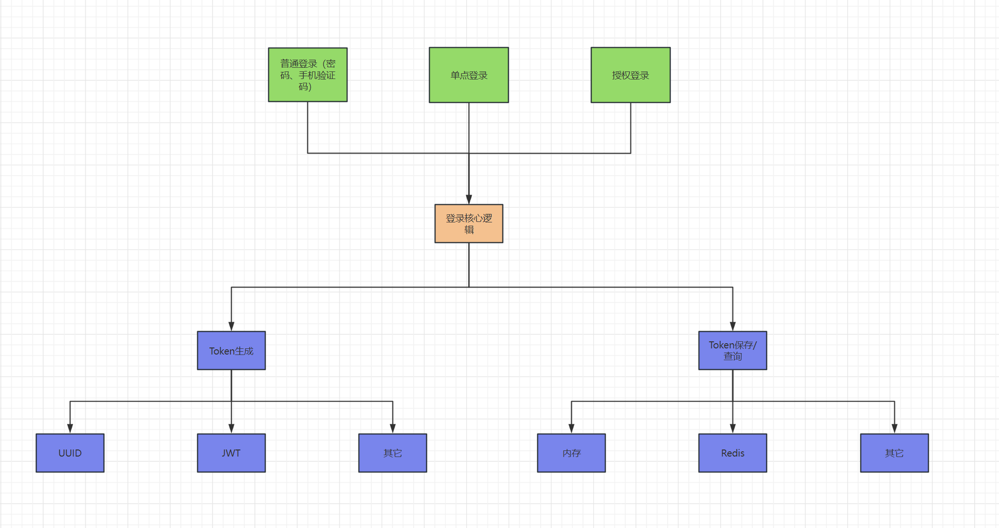
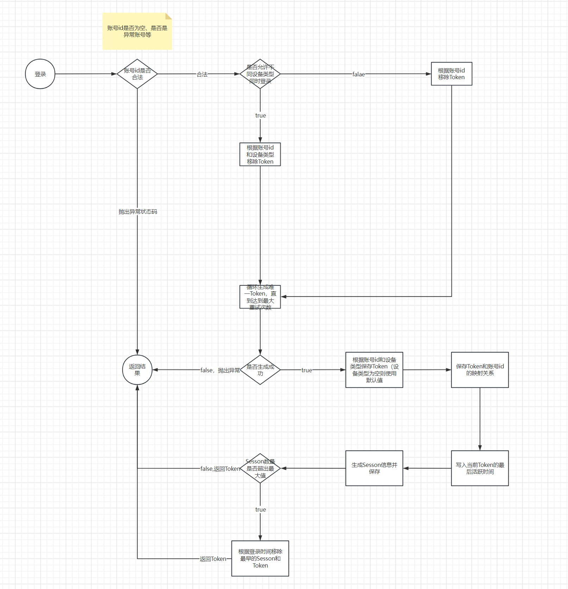

# auth-demo
登录认证demo，本项目主要是基于Sa-Token的设计和思想自己实现一遍，旨在学习理解登录认证中的关键点。
# 实现功能
Sa-Token包含功能非常完整，而本项目只是学习理解，所以不会实现Sa-Token的全部功能，主要会包含以下功能点：
- 普通登录（密码、验证码等）
- 同端互斥登录
- 存储扩展
- 前后端分离
- 单点登录
- 授权登录
# 设计方案
## 系统整体架构

## 设计思路
登录系统整体可分为三类：普通登录（如密码、验证码）、单点登录、三方授权登录。虽然分为三类，
但核心登录逻辑都是一致的，如生成token信息、token保存查询、token验证、互斥登录校验等，
所以可以将核心逻辑封装，上层普通登录、单点登录、授权登录在各自处理完自己的特异逻辑后，
统一调用核心逻辑即可。而针对token的生成、保存也可以预留扩展点，让使用者可以更具自己的需求
进行扩展，比如可以使用UUID、JWT生成token，token可以保存在内存中，也可以保存在Redis或数据库中。
## 核心登录
### 登录详细流程

### 建模
